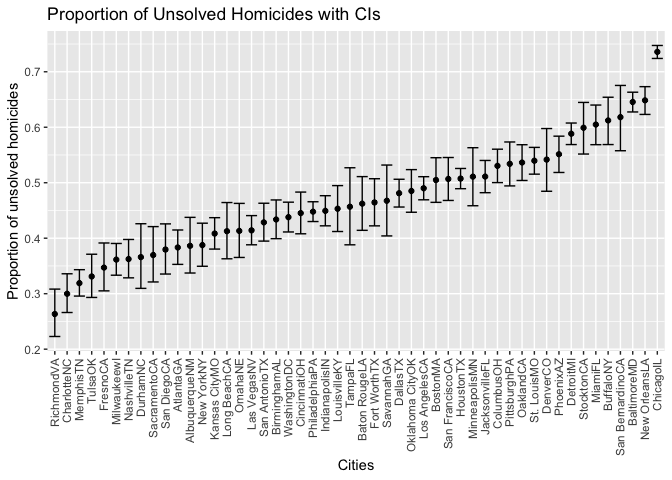
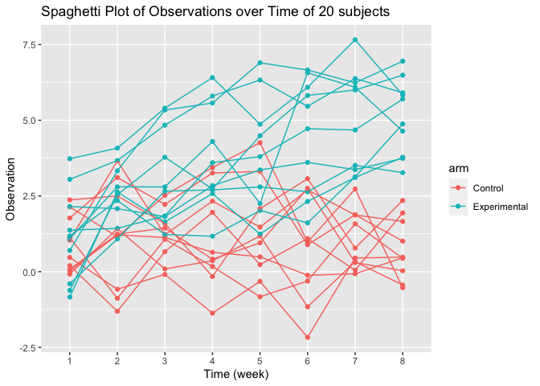

Homework 5
================
Zoey Zhao
11/19/2021

``` r
library(tidyverse)
```

## Problem 1

For this problem, we are interested in the data released by *The
Washington Post* in homicides in 50 large U.S. cities. The code chunk
below imports and cleans the data.

``` r
homicide_data <- read_csv("https://raw.githubusercontent.com/washingtonpost/data-homicides/master/homicide-data.csv", na = c("", "Unknown"))%>%
  mutate(
    city_state = str_c(city, state),
    resolution = case_when(
      disposition == "Closed without arrest" ~ "Unsolved",
      disposition == "Open/No arrest" ~ "Unsolved",
      disposition == "Closed by arrest" ~ "Solved"
    ))%>%
  relocate(city_state)%>%
  filter(city_state != "TulsaAL")
```

Let’s focus on Baltimore, MD.

``` r
baltimore_df <-
  homicide_data%>%
  filter(city_state == "BaltimoreMD")

baltimore_summary <-
  baltimore_df%>%
  summarize(
    unsolved = sum(resolution == "Unsolved"),
    n = n())

baltimore_test <-
  prop.test(
  x = baltimore_summary%>%pull(unsolved),
  n = baltimore_summary%>%pull(n)
)

baltimore_test%>%
  broom::tidy()
```

    ## # A tibble: 1 × 8
    ##   estimate statistic  p.value parameter conf.low conf.high method    alternative
    ##      <dbl>     <dbl>    <dbl>     <int>    <dbl>     <dbl> <chr>     <chr>      
    ## 1    0.646      239. 6.46e-54         1    0.628     0.663 1-sample… two.sided

There are 64.6% of homicides in Baltimore are not solved, with a 95% CI
62.8%-66.3%.

Let’s try to iterate across the cities. 1. Write a function

``` r
prop_test_function <- function(city_df) {
  city_summary <-
  city_df%>%
  summarize(
    unsolved = sum(resolution == "Unsolved"),
    n = n()
    )
  city_test <-
  prop.test(
  x = city_summary%>%pull(unsolved),
  n = city_summary%>%pull(n)
  )
  
  return(city_test)
}
```

2.  Iterate across all cities

``` r
nested_df <-
  homicide_data%>%
  nest(data = uid:resolution)%>%
  mutate(
    test_results = map(data, prop_test_function),
    tidy_results = map(test_results, broom::tidy)
  )%>%
  select(city_state, tidy_results)%>%
  unnest(tidy_results)%>%
  select(city_state, estimate, starts_with("conf"))

nested_df
```

    ## # A tibble: 50 × 4
    ##    city_state    estimate conf.low conf.high
    ##    <chr>            <dbl>    <dbl>     <dbl>
    ##  1 AlbuquerqueNM    0.386    0.337     0.438
    ##  2 AtlantaGA        0.383    0.353     0.415
    ##  3 BaltimoreMD      0.646    0.628     0.663
    ##  4 Baton RougeLA    0.462    0.414     0.511
    ##  5 BirminghamAL     0.434    0.399     0.469
    ##  6 BostonMA         0.505    0.465     0.545
    ##  7 BuffaloNY        0.612    0.569     0.654
    ##  8 CharlotteNC      0.300    0.266     0.336
    ##  9 ChicagoIL        0.736    0.724     0.747
    ## 10 CincinnatiOH     0.445    0.408     0.483
    ## # … with 40 more rows

Create a plot that shows the estimates and CIs for each city, and
organize cities according to the proportion of unsolved homicides.

``` r
nested_df%>%
  mutate(city_state = fct_reorder(city_state, estimate))%>%
  ggplot(aes(x = city_state, y = estimate))+
  geom_point()+
  geom_errorbar(aes(ymin = conf.low, ymax = conf.high))+
  theme(axis.text.x = element_text(angle = 90, vjust = 0.5, hjust = 1))+
  labs(title = "Proportion of Unsolved Homicides with CIs",
       x = "Cities", 
       y = "Proportion of unsolved homicides")
```

<!-- -->

## Problem 2

Start with a dataframe containing all file names.

``` r
file_name <-
  tibble(list.files("./data/zip_data/"))%>%
           mutate(name = list.files("./data/zip_data/"))%>%
           select(name)
```

Iterate over file names and read in data for each subject and saving the
result as a new variable in the dataframe.

``` r
all_file <-
  data_frame(name = pull(file_name, name)) %>%
  mutate(data = map(name,      
           ~ read_csv(file.path("./data/zip_data", .))
           )
         )
```

    ## Warning: `data_frame()` was deprecated in tibble 1.1.0.
    ## Please use `tibble()` instead.
    ## This warning is displayed once every 8 hours.
    ## Call `lifecycle::last_lifecycle_warnings()` to see where this warning was generated.

``` r
unnest(all_file)
```

    ## Warning: `cols` is now required when using unnest().
    ## Please use `cols = c(data)`

    ## # A tibble: 20 × 9
    ##    name       week_1 week_2 week_3 week_4 week_5 week_6 week_7 week_8
    ##    <chr>       <dbl>  <dbl>  <dbl>  <dbl>  <dbl>  <dbl>  <dbl>  <dbl>
    ##  1 con_01.csv   0.2   -1.31   0.66   1.96   0.23   1.09   0.05   1.94
    ##  2 con_02.csv   1.13  -0.88   1.07   0.17  -0.83  -0.31   1.58   0.44
    ##  3 con_03.csv   1.77   3.11   2.22   3.26   3.31   0.89   1.88   1.01
    ##  4 con_04.csv   1.04   3.66   1.22   2.33   1.47   2.7    1.87   1.66
    ##  5 con_05.csv   0.47  -0.58  -0.09  -1.37  -0.32  -2.17   0.45   0.48
    ##  6 con_06.csv   2.37   2.5    1.59  -0.16   2.08   3.07   0.78   2.35
    ##  7 con_07.csv   0.03   1.21   1.13   0.64   0.49  -0.12  -0.07   0.46
    ##  8 con_08.csv  -0.08   1.42   0.09   0.36   1.18  -1.16   0.33  -0.44
    ##  9 con_09.csv   0.08   1.24   1.44   0.41   0.95   2.75   0.3    0.03
    ## 10 con_10.csv   2.14   1.15   2.52   3.44   4.26   0.97   2.73  -0.53
    ## 11 exp_01.csv   3.05   3.67   4.84   5.8    6.33   5.46   6.38   5.91
    ## 12 exp_02.csv  -0.84   2.63   1.64   2.58   1.24   2.32   3.11   3.78
    ## 13 exp_03.csv   2.15   2.08   1.82   2.84   3.36   3.61   3.37   3.74
    ## 14 exp_04.csv  -0.62   2.54   3.78   2.73   4.49   5.82   6      6.49
    ## 15 exp_05.csv   0.7    3.33   5.34   5.57   6.9    6.66   6.24   6.95
    ## 16 exp_06.csv   3.73   4.08   5.4    6.41   4.87   6.09   7.66   5.83
    ## 17 exp_07.csv   1.18   2.35   1.23   1.17   2.02   1.61   3.13   4.88
    ## 18 exp_08.csv   1.37   1.43   1.84   3.6    3.8    4.72   4.68   5.7 
    ## 19 exp_09.csv  -0.4    1.08   2.66   2.7    2.8    2.64   3.51   3.27
    ## 20 exp_10.csv   1.09   2.8    2.8    4.3    2.25   6.57   6.09   4.64

Tidy the result; manipulate file names to include control arm and
subject ID, make sure weekly observations are “tidy”, and do any other
tidying that’s necessary

``` r
tidy_data<-
  all_file%>%
  unnest()%>%
  separate(name, c("arm", "other"), sep = "_")%>%
  mutate(subject_id = c(1:20),
         arm = as.factor(case_when(arm == "con" ~ "Control",
                         arm == "exp" ~ "Experimental")))%>%
  relocate(subject_id)%>%
  select(!other)%>%
  pivot_longer(week_1:week_8, names_to = "week", names_prefix = "week_")
```

    ## Warning: `cols` is now required when using unnest().
    ## Please use `cols = c(data)`

``` r
tidy_data
```

    ## # A tibble: 160 × 4
    ##    subject_id arm     week  value
    ##         <int> <fct>   <chr> <dbl>
    ##  1          1 Control 1      0.2 
    ##  2          1 Control 2     -1.31
    ##  3          1 Control 3      0.66
    ##  4          1 Control 4      1.96
    ##  5          1 Control 5      0.23
    ##  6          1 Control 6      1.09
    ##  7          1 Control 7      0.05
    ##  8          1 Control 8      1.94
    ##  9          2 Control 1      1.13
    ## 10          2 Control 2     -0.88
    ## # … with 150 more rows

Make a spaghetti plot showing observations on each subject over time,
and comment on differences between groups.

``` r
tidy_data%>%
  ggplot(aes(x = week , y = value, color = arm))+
  geom_point()+
  geom_line(aes(group = subject_id))+
  labs(title = "Spaghetti Plot of Observations over Time of 20 subjects",
       y = "Observation",
       x = "Time (week)")
```

<!-- -->

Subjects in experimental group seems to have overall higher levels of
observations than subjects in control group during the 8-week period of
time. The level of observation in experimental group has a trend of
growing over time, and the level of observation in control group does
not have any obvious changes overall in 8 weeks.

## Problem 3

``` r
set.seed(10)

iris_with_missing <-
  iris %>% 
  map_df(~replace(.x, sample(1:150, 20), NA)) %>%
  mutate(Species = as.character(Species))
```

Write a function filling missing values:

``` r
fill_in_missing <- function(vec) {
  if (is.numeric(vec)) {
    mean = mean(na.omit(vec))
    new_vec = replace_na(vec, mean)
    return(round(new_vec, digits = 1))
  }
  else if(is.character(vec)) {
    return(replace_na(vec, "virginica"))
  }
  else {
    stop("Imput should be a vector of numeric or character variables.")
  }
}
```

Apply this function to the columns of `iris_with_missing` using a `map`
statement.

``` r
iris_list <-
  as.list(iris_with_missing)

filled_iris <- map_df(iris_list, fill_in_missing)
filled_iris
```

    ## # A tibble: 150 × 5
    ##    Sepal.Length Sepal.Width Petal.Length Petal.Width Species
    ##           <dbl>       <dbl>        <dbl>       <dbl> <chr>  
    ##  1          5.1         3.5          1.4         0.2 setosa 
    ##  2          4.9         3            1.4         0.2 setosa 
    ##  3          4.7         3.2          1.3         0.2 setosa 
    ##  4          4.6         3.1          1.5         1.2 setosa 
    ##  5          5           3.6          1.4         0.2 setosa 
    ##  6          5.4         3.9          1.7         0.4 setosa 
    ##  7          5.8         3.4          1.4         0.3 setosa 
    ##  8          5           3.4          1.5         0.2 setosa 
    ##  9          4.4         2.9          1.4         0.2 setosa 
    ## 10          4.9         3.1          3.8         0.1 setosa 
    ## # … with 140 more rows
